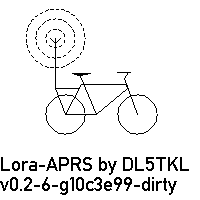
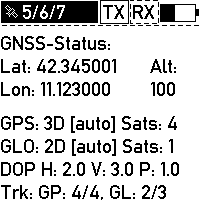
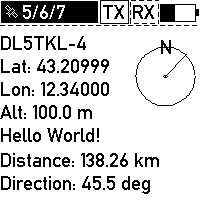
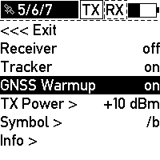
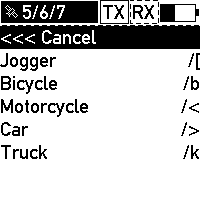

# LoRa-APRS firmware for Lilygo T-Echo

This is a custom firmware for the T-Echo devices made by Lilygo.

With this firmware the T-Echo becomes a LoRa-APRS tracker. The LoRa
transmissions are compatible with the popular
[LoRa-APRS-iGate](https://github.com/lora-aprs/LoRa_APRS_iGate) firmware for
some ESP32-based devices usually used as iGates.

One particular focus of this firmware is to use the low-power capabilites of
the T-Echo. With the standard 800 mAh battery, it achieves more than 10 hours
of active tracking, multiple days of lora reception and 1 to 4 months of
standby (reachable via BLE; standby time depends on hardware configuration).

## Features

- Ultra low power usage:
  - At any point, only the necessary modules are powered.
  - nRF52840 is in deep sleep most of the time.
  - Achieves down to 100 μA standby current with full BLE connectivity
    (depending on hardware assembly variant).
- Tracker/transmitter:
  - Smart beacon: transmissions depend on movement.
  - Configurable TX power up to +22 dBm.
- Receiver:
  - Tries to decode received packets and
  - Displays remote station call sign, location, distance and direction on success.
  - Undecodable packets are displayed as raw text.
- E-Paper display:
  - Support for partial refresh (no flickering; 0.3 s refresh time).
  - Force full refresh (with flickering) every 1 hour to remove artifacts and prevent burn-in.
- GNSS warmup mode:
  - Keeps the GNSS module powered without transmitting LoRa packets.
  - Can be used to achieve a good position fix before enabling the transmitter
    (which might interefere with the GNSS receiver).
- Bluetooth Low Energy:
  - Configure source call sign, APRS symbol, and comment.
  - Notification support for received APRS messages.

### APRS protocol support

- Configurable symbol (through on-screen menu and BLE)
- Human-readable (standard) format support:
  - `!DAO!` for improved latitude/longitude precision (see [APRS 1.2 specification](http://www.aprs.org/aprs12/datum.txt))
  - altitude
- Compressed format support (see [APRS 1.0 specification](http://www.aprs.org/doc/APRS101.PDF))
  - Encodes latitude, longitude, altitude and symbol in only 13 characters
- Everything above can be transmitted and received/decoded!

## Screenshots

Here are some screenshots of a pre-v0.3 development version from the [display
simulator](./test/display/) I use to develop the display layout. The data shown
is obviously fake, but the screen layout on the device is identical.

The startup screen:



GNSS and tracker status:




Screen shown when a packet is successfully received and decoded. It shows the course and distance to the other station:



Impressions from the menu system:




## Disclaimer

I provide this firmware in the hope that it will be useful. However I can not
guarantee that it will work on your device.

**It may even break your device** if you have a different hardware version with a
different pin assignment or power distribution network or other
LoRa/GNSS/display modules. You are using this on your own risk.

**Before you try this firmware, make sure that the pinout in `config/pinout.h`
matches your device!**

## Hardware support

This firmware should support T-Echos with the following components:

- BLE SoC nRF52840
- ePaper display GDEH0154D67 with controller SSD1681
- GNSS module L76K (other NMEA-via-UART capable modules should also work)
- LoRa transceiver SX1262

## Usage

The device is operated using the two free buttons: the touch button on the
top of the device and the push button on the bottom left. The top left button
is the hardware reset button for the SoC.

In any state, the touch button enables the display backlight for three seconds.

In normal state (the state entered after firmware boot), a short press on the
lower-left push button switches to the next display state (i.e. tracker state,
GNSS state, received and decoded messages). A long press on this button opens
the menu.

The menu is operated as follows:

- Use the touch button to cycle through the menu items. The selected item is
  displayed in inverted colors (black background and white text).
- A short press on the lower-left push button activates the selected item.
  Changes are applied immediately. Activations means:
  - _on/off_-type items are toggled
  - Submenus are entered (for items with `>`) or left (items starting with `<<<`)
  - Selected values are applied (for example in the symbol selection submenu)


## Building the firmware

**Please note:** [pre-built
binaries](https://github.com/cfr34k/t-echo-lora-aprs/releases) are also
available and strongly recommended. Skip this section if you are using those.

To compile the firmware you need to set up the toolchain for Nordic
Semiconductor’s nRF5 SDK. See [the SDK
documentation](https://infocenter.nordicsemi.com/topic/struct_sdk/struct/sdk_nrf5_latest.html)
for setup instructions. Only compilation via GCC is supported. If you can build
any example from the SDK (located in `nrf5-sdk/examples/`) you should be good
to go.

To compile the firmware, simply run

```sh
make
```

This will give you firmware binaries (ELF and HEX files) that you can use to
directly flash a device via SWD and debug the firmware. All outputs are stored
in a new directory called `_build`.

To generate UF2 files that can be used with the preinstalled bootloader the following commands are available.

```sh
make uf2_sd
```

This generates a complete installation image
(`_build/nrf52840_xxaa_with_sd.uf2`) that can be used to flash devices
currently running a different firmware.

Alternatively, you can create a simple update image with

```sh
make uf2
```

The resulting image (`_build/nrf52840_xxaa.uf2`) can only be used to upgrade
devices that run different versions of this LoRa-APRS firmware. However, it is
much smaller and therefore faster to download and flash.

## Flashing the firmware

This firmware is compatible with the [T-Echo’s preinstalled
bootloader](https://github.com/Xinyuan-LilyGO/T-Echo/tree/main/bootloader), so
you can simply install it like an regular firmware update (tested with the
Meshtastic version, not sure about the SoftRF version).

Short reminder: to invoke the bootloader, double-press the reset button and
connect the T-Echo to your PC via USB-C. It should appear as a mass-storage
device called `TECHOBOOT`.

### Initial installation

**Back up your current firmware before installing this firmware.** To do so,
copy the `CURRENT.UF2` from the T-Echo’s mass storage device `TECHOBOOT` to
your PC.

When you first install the LoRa-APRS firmware, you must also install the
correct SoftDevice (Bluetooth stack).  Therefore, download the latest
`nrf52840_xxaa_with_sd.uf2` from the [Releases
page](https://github.com/cfr34k/t-echo-lora-aprs/releases) (or use the one you
built yourself) which contains both the SoftDevice and the regular firmware
build. Copy `nrf52840_xxaa_with_sd.uf2` to the `TECHOBOOT`. When the copy
operation is complete, the device should disconnect, reset, and boot the
LoRa-APRS firmware.

After initial installation, **you have to configure your call sign to be able to
transmit LoRa packets** (see _Configuring the firmware_ below).

### Normal updates

If the SoftDevice is unchanged, only the firmware part needs to be updated. To
do so, [download](https://github.com/cfr34k/t-echo-lora-aprs/releases) or build
`nrf52840_xxaa.uf2`. Copy that file to `TECHOBOOT` and you are done.

## Configuring the firmware

There are two ways to configure certain aspects of the firmware: via Bluetooth
LE and via the on-screen menu.

### Via the menu

The following aspects are configurable via the menu:

- Status of tracker, receiver and GNSS warmup
- APRS symbol (limited selection)
- Transmission power

### Via Bluetooth LE

Via BLE you can set the following:

- Source call sign
- APRS symbol (free selection of symbol table and icon)
- APRS comment (free text)

The source call sign must be set to be able to transmit APRS packets.

All settings (_characteristics_ in the Bluetooth jargon) of the LoRa-APRS
firmware are gathered in a custom _APRS service_ with UUID
`00000001-b493-bb5d-2a6a-4682945c9e00`. The following characteristics are
available:

| UUID                                   | Description                         | Encoding | Value length    | Access       | Example |
|----------------------------------------|-------------------------------------|----------|-----------------|--------------|---------|
| `00000101-b493-bb5d-2a6a-4682945c9e00` | APRS source call sign               | Text     | 0-16 characters | Read, write  | `DE0ABC-5` |
| `00000102-b493-bb5d-2a6a-4682945c9e00` | APRS comment                        | Text     | 0-64 characters | Read, write  | `T-Echo on tour` |
| `00000103-b493-bb5d-2a6a-4682945c9e00` | APRS symbol (Table + Icon selector) | Text     | 2 characters    | Read, write  | `/.` (red X on the map) |
| `00000104-b493-bb5d-2a6a-4682945c9e00` | Raw received message                | Binary   | 1-247 bytes     | Read, notify | `<\xff\x01DE0ABC-5>APZTK1:…` |

#### Python-based client

A simple Python script based on the [Bleak BLE
library](https://bleak.readthedocs.io/en/stable/index.html) is available for
configuring the device. It should work on any platform that Bleak works on, but
I can only test it on Linux.

To use the script, first install the correct version of Bleak (consider using a
[Python Virtual Environment](https://docs.python.org/3/library/venv.html)):

```sh
pip install -r tools/ble_client/requirements.txt
```

Then, run the script:

```sh
cd tools/ble_client/
./techo_client.py
```

The script provides a simple menu system with indexed entries. To select an
entry, just type the corresponding index when prompted to do so.

When started, the script will first scan for T-Echos and list all that were
found. You pick one and the script connects to it. You can then select from
various actions, including listing and changing the current settings.

#### Generic configuration options

If you cannot use the Python script described above, you can try a generic BLE
exploration/debugging app like [nRF Connect for
Mobile](https://www.nordicsemi.com/Products/Development-tools/nRF-Connect-for-mobile)
to write the available BLE characteristics.

## License

For license information, see [COPYING](COPYING).
