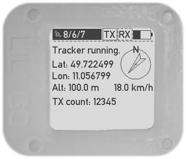

= User manual
Thomas Kolb
v1.0: For firmware version 0.8
:toc:
:xrefstyle: short

This document describes how to operate the T-Echo while it runs the LoRa-APRS firmware.

== The T-Echo’s Buttons

The main user interface are the three buttons on the T-Echo:

- Reset button (left side, top button)
- Generic push button (left side, bottom button)
- Touch button (top side)

=== The Reset Button

The reset button is hard-wired to the reset pin of the nRF52840 SoC.

Pressing this button once immediately restarts the firmware. All temporary
state is lost (such as received messages) and everything (RX, TX, GNSS) is
turned off.

Pressing the reset button twice in a very short time invokes the T-Echo’s
Bootloader where you can upload new firmware versions via USB. While in the
bootloader, the red LED usually fades in and out rapidly, but that depends on
the bootloader of your device. The device might simply appear to be hanging
while in bootloader mode, so if you are confused why your device does not react
to button presses, the bootloader might be active accidentally. Simply press
reset once to boot into the firmware again.

=== The Generic Push Button

This button is used for actions that need to be reliably executed with haptic
feedback (which the touch button cannot provide).

Functions are:

- Outside of the menu:
  - Short press: switch to the next screen.
  - Long press (1 second): open the menu.
- Inside the menu:
  - Short press: activate the selected menu entry.

=== The Touch Button

The functions of the touch button are:

- In any mode, a short tap updates the display.
- Inside the menu, a short tap selects the next menu entry.
- On the RX Overview screen, a short tap selects the next received station.

=== Button combination

A short press on the Generic Push Button while the Touch button is held enables
or disables RX and TX in the following sequence:

- Both RX and TX off (state after reset)
- Only RX on
- Both RX and TX on
- Only RX off
- Both RX and TX off again

This allows to quickly enable the desired mode without navigating the menu first.

== The Menu

The on-screen menu allows to configure certain aspects of the firmware without
the need for an additional Bluetooth-capable device. To enter the menu, press
and hold the Generic Push Button for at least one second.

There are some additional markers on some menu items that indicate what happens
when the item is activated: items starting with `<<<` return to the previous
menu level or leave the menu, items that end with `>` open submenus.

This sections describes the menu structure in detail.

=== Main Menu

The main menu is the menu first shown after the menu is entered.

.The main menu screen
[main-menu-screenshot]
image::screenshots/overlay/menu_top.webp[Main menu]

- `<<< Exit` +
  Exit the menu and return to the normal status screens.
- `Receiver` +
  Enables or disables the receiver. The current status (`on` or `off`) is shown
  to the right of the screen.
- `Tracker` +
  Enables or disables the tracker. The current status (`on` or `off`) is shown
  to the right of the screen.
- `GNSS Utilities >` +
  Go to the <<_gnss_utilities,GNSS utilities submenu>> that provides some tools that might help with GNSS problems.
- `APRS Config >` +
  Open the <<_aprs_config,APRS configuration submenu>>.
- `Info >` +
  Open the <<info,device/firmware information menu>>.
- `Shutdown` +
  Puts the device in the lowest power mode possible. Stops all activity
  (including BLE) and clears the display. Note that the device still draws
  current from the battery in this state (about 200 μA).

=== GNSS Utilities

The GNSS utilities menu provides some functions that might be useful if your
GNSS cannot find a position any more.

- `<<< Back` +
  Return to the <<_main_menu,Main menu>>.
- `Keep GNSS powered` +
  Here the GNSS module can be kept powered even if the tracker is off. This
  allows the module more time to find the satellites and avoids interference
  from the transmitter that might cause the GNSS module to loose the position
  fix again.
- `Cold restart` +
  Sends a cold restart command to the GNSS module. The module then erases all
  information it currently has about the satellite constellations and the
  current position and starts a completely new acquisition. It can take up to
  15 minutes until a position is found again. It is therefore recommended to
  enable `Keep GNSS powered` before executing this command and keep it on until
  a position is available again.

=== APRS Config

The APRS configuration submenu allows to configure how the transmitted packets
look. The following items are available on this menu level:

- `<<< Back` +
  Return to the <<_main_menu,Main menu>>.
- `Compressed format` +
  Enable the compressed ASCII position format, as specified in the
  http://www.aprs.org/doc/APRS101.PDF[APRS 1.0 specification]. This format
  encodes position, altitude and APRS symbol in only 13 ASCII characters. The
  location precision is better than the uncompressed format without `!DAO!`.
  Enabling this makes the settings for `Altitude` and `DAO` irrelevant, as
  altitude is included in the compressed format anyway and `!DAO!` is not
  necessary.
- `Altitude` +
  Include the altitude in uncompressed packets. Altitude is always included in
  compressed packets and if compression is enabled, this setting is ignored.
- `DAO` +
  Add the `!DAO!` extension to uncompressed packets. This extension adds 5
  additional characters to the message that improve the location precision. The
  format is defined in the http://www.aprs.org/aprs12/datum.txt[APRS 1.2
  specification]. Compressed packets have sufficient location precision anyway
  and this setting is therefore ignored if compression is enabled.
- `Advanced >>>` +
  Open the <<aprs_advanced,advanced APRS configuration>> submenu.
- `Symbol >>>` +
  Open the <<aprs_symbol,APRS symbol selection>> submenu.
- `TX Power >` +
  Open the <<_tx_power,transmit power selection submenu>>.

=== TX Power

The transmit power selection submenu allows to choose between various
transmission power levels. The following levels are available: +22 dBm, +20
dBm, +17 dBm, +14 dBm, +10 dBm, 0 dBm, -9 dBm.

[#aprs_advanced]
==== Advanced APRS Configuration

This menu allows to include extended information in the transmitted packets.

- `Frame counter` +
  Includes a counter in the transmitted packets that is incremented on every
  transmission. This allows to evaluate packet loss by looking at the counter
  values in received packets. The counter restarts at 1 when the tracker is
  disabled or the T-Echo is reset.
- `Battery voltage` +
  Transmit the current battery voltage in every packet.
- `Weather report` [Devices with BME280 only] +
  Periodically include the latest environmental sensor measurements in the
  packet. See <<_weather_reports>> for details.
- `Startup state` +
  Defines the initial state of the APRS receiver and tracker after the firmware
  is restarted. Activating the menu item cycles through the combinations, as
  follows:
  - `RX+TX off`: no activity at all after startup. This is the lowest power state.
  - `RX only`: Only the receiver is started automatically.
  - `RX+TX on`: Automatically activate both the receiver and the tracker.
  - `TX only`: Only the tracker is started automatically.
- `Digipeating` +
  Sets the method of digipeating to use
  - `off`: digipeating is disabled and the digipeater path is empty. This
           results in the shortest packets.
  - `Dest. Call`: The number of hops is encoded in the destination call SSID
                  (used up to version 1.0). Only adds two bytes to the packet.
  - `WIDEn-n`: Add `WIDE1-1` to the digipeater path. This has the largest
               overhead, but also the widest support in digipeaters.

As of version 1.1, only one digipeater hop is supported (i.e. `WIDE1-1`).

[#aprs_symbol]
==== APRS Symbol Selection

This submenu allows to select the APRS symbol (that is displayed on websites
like https://aprs.fi[aprs.fi] for example) from a pre-defined set of frequently
used symbols.

Note that you can also set an arbitrary symbol code via
<<_bluetooth_low_energy,Bluetooth Low Energy>>. The last symbol set via BLE is
saved persistently and can also be selected from this menu.

Symbols currently available are: Jogger, Bicycle, Motorcycle, Car and Truck.

[#info]
=== Device Information

The `Info` submenu provides information about the firmware and the most relevant device settings.

Activating any entry in this submenu returns to the <<_main_menu, main menu>>.

== The Different Screens Explained

=== Common Status Bar

In most status screens and the menu a common status bar is shown at the top of
the screen which indicates the most important function states.

<<status-bar-screenshot>> shows the time and weather screen (see
<<_time_and_weather_screen>> for details) which has the status bar on the top.
The elements are from left to right:

- *GNSS Status*: This block indicates the status of the GNSS and shows the
  number of satellites. If the block is filled white with a dashed border, the
  GNSS is disabled. If the border is solid, the GNSS is powered, but has no
  position fix (yet). When the fill becomes black, a position fix has been
  achieved. The number of satellites is shown as `A/B/C` where `A` is the
  number of satellites used to calculate the position, `B` is the number of
  satellites being tracked (i.e. a signal is received) and `C` is how many
  satellites are currently in view (above the horizon).
- *TX Status*: This block indicates the status of the tracker. If the tracker
  is disabled, the `TX` block has a white background and a dashed border. If
  the tracker is enabled, the background is still white but the border becomes
  solid. While a packet is transmitted the colors are inverted, i.e. the
  background becomes black.
- *RX Status*: This block indicates the status of the receiver. If the receiver
  is disabled, the block has a white background and a dashed border. When
  actively receiving, the background is black and the text is white. If the
  receiver has been interrupted because a packet is transmitted, the background
  becomes white, but the border is solid black.
- *Battery Status*: This part shows the current battery level as a progress
  bar. A full battery is filled solid black, an empty battery is solid white.
  When USB is connected, the battery is always shown as full once the voltage
  has been measured even if it is still charging.

.Screenshot of the Time and Weather screen with the common status bar at the top.
[#status-bar-screenshot]

=== Startup Screen

.The startup screen
[startup-screenshot]

The startup screen shows the logo and version number (including Git commit
identifier if it is not a tagged release).

If the Generic Push Button is pressed and held while the startup screen is
initially shown on the display (i.e. while the screen flickers black and
white), the Bluetooth bonding keys are erased once the refresh completes and
the menu is shown. This may be necessary if you cannot connect to the T-Echo
via Bluetooth Low Energy.

=== GNSS Status

.The GNSS status screen
[gnss-status-screenshot]
image::screenshots/overlay/gnss_status.webp[GNSS status screen]

The GNSS status screen shows the current state of the GNSS module.

If a position is currently available, the first two lines after the title show
the https://de.wikipedia.org/wiki/World_Geodetic_System_1984[WGS84] coordinates
in decimal format and the altitude in meters. If a position is not available,
the coordinates are replaced by `No fix :-(`.

Below, the status of the individual satellite systems is shown. Each line
contains the following information:

* System name:
** `GPS`: The well-known american Global Positioning System.
** `GLO`: The russian GLONASS system.
* Current fix mode (`3D` or `2D`)
* Way to determine the fix mode (should be `auto`)
* Number of satellites used in this system

After the system status, the
https://en.wikipedia.org/wiki/Dilution_of_precision_(navigation)[dilution of
precision (DOP)] is shown in **H**orizontal, **V**ertical and **P**osition (3D)
mode. The DOP indicates how precicely the position can be calculated from the
currently visible satellites. Lower values are better, and a value of 1 or
lower is ideal.

The last line at the bottom shows how many of the known satellites are
currently being tracked per navigation system. `GP` is GPS, `GL` is GLONASS.

=== Tracker Status

.The Tracker status screen
[tracker-status-screenshot]

This screen gives an overview of the tracker’s status. The first line indicates
whether the tracker is currently running or stopped. Running means that APRS
transmission will be made.

Below, the current
https://de.wikipedia.org/wiki/World_Geodetic_System_1984[WGS84] coordinates are
shown. Also the number of packets that have been transmitted since the tracker
was enabled is displayed here.

If the position fix is sufficiently good, the GNSS module calculates a movement
speed and direction. As this information is essential for the smart beacon, it
is also displayed on this screen if it is available.

The current course is display graphically as a circle with a line pointing from
the center into the direction of movement compared to north (indicated by the
`N` at the top). Below the course display, the current speed is shown in
kilometers per hour.

=== RX Overview Screen

.The RX overview screen
[rx-overview-screenshot]

This screen shows the last three received stations and when the last corrupted
packet was received.

For each station, the following information is displayed:

- The station’s call sign and SSID
- How long ago the packet was received in seconds (`s`), minutes (`m`), hours (`h`) or days (`d`)
- The distance to the other station measured from your _current_ location (_not_ your location at the time of reception!)
- Course towards the station represented with an arrow (north is always up)

When a new packet is successfully decoded and the station already exists in the
list, the corresponding entry is updated. As long as there is free space in the
list, new stations are appended. When all three slots are filled and a new
station is received, the oldest station in the list is replaced by the new
station.

One of the received stations or the “Last error” entry can be selected by tapping the Touch Button. Details about the selected station are shown on the <<_rx_detail_screen,RX Details Screen>>.

=== RX Detail Screen

.The RX detail screen
[rx-detail-screenshot]

The RX detail screen shows detailed information about the station selected on
the <<_rx_overview_screen,RX Overview Screen>>.

On the left, the following is displayed from top to bottom:

- The remote station’s call sign and SSID
- The remote station’s
  https://de.wikipedia.org/wiki/World_Geodetic_System_1984[WGS84] coordinates
  and altitude
- The APRS comment
- The signal quality in the format `R: A / B / C` where `A` is the RSSI, `B` is
  the SNR and `C` is the “Packet RSSI”.footnote:[I’m not sure what the
  difference between RSSI and Packet RSSI actually is. If you know, please tell
  me or update this documentation! - DL5TKL]

On the top right, the course and distance towards the other station is
visualized. If your own GNSS receiver currently provides your movement
direction, it is also shown in the direction diagram with a dashed line. This
allows to navigate towards the other station by aligning the two direction
pointers.

=== Time and Weather Screen

.The time and weather screen
[time-weather-screenshot]

This screen shows the current time, date and optionally environmental data.

The time and date are always displayed in UTC. There is no support for
timezones in this firmware.

The time is synchronized via GNSS, so the GNSS module has to have a location
fix at least once before a plausible time and date is shown. If a fix was not
achieved since the last reset, the time starts running on 1970-01-01 at 0:00.

If your T-Echo contains a BME280 environmental sensor, the measured values are
also shown on this screen.

NOTE: As the BME280 is inside the case and right behind the LoRa module,
thermal isolation is rather bad and the temperature and humidity values are way
off while the tracker is running or the T-Echo is charged. Therefore, the
T-Echo is not really usable as a LoRa weather station.

== Bluetooth Low Energy

The BLE interface is primarily used to configure the firmware. All settings
(_characteristics_ in the Bluetooth jargon) of the LoRa-APRS firmware are
gathered in a custom _APRS service_ with UUID
`00000001-b493-bb5d-2a6a-4682945c9e00`. The following characteristics are
available:

[cols="3,2,1,1,1,2", options="header"]
|===

| UUID
| Description
| Encoding
| Value length
| Access
| Example

| `00000101-b493-bb5d-2a6a-4682945c9e00`
| APRS source call sign
| Text
| 0-16 characters
| Read, write
| `DE0ABC-5`

| `00000102-b493-bb5d-2a6a-4682945c9e00`
| APRS comment
| Text
| 0-64 characters
| Read, write
| `T-Echo on tour`

| `00000103-b493-bb5d-2a6a-4682945c9e00`
| APRS symbol (Table + Icon selector)
| Text
| 2 characters
| Read, write
| `/.` (red X on the map)

| `00000104-b493-bb5d-2a6a-4682945c9e00`
| Raw received message
| Binary
| 1-247 bytes
| Read, notify
| `<\xff\x01DE0ABC-5>APZTK1:…`

| `00000110-b493-bb5d-2a6a-4682945c9e00`
| Setting select or write
| Binary/setting-dependent
| 1-247 bytes
| Write
| `\x07\x34\x88\x38\x1a`

| `00000111-b493-bb5d-2a6a-4682945c9e00`
| Setting read
| Binary/setting-dependent
| 1-247 bytes
| Read, notify
| `\x07\x34\x88\x38\x1a`

|===

In general, binary multi-byte values are encoded as Little Endian, i.e. the
least significant byte is the leftmost in the value. For example, the decimal
number `13579` represented in hex is `0x350b`, and is encoded in little endian
as `0x0b 0x35`.

=== _Source Call Sign_ characteristic

This characteristic holds the source call sign for APRS transmissions. It must
be set to the amateur radio call sign of the operator of the device before any
transmission is possible.

Optionally, an SSID may be appended to differentiate multiple devices of the
same operator. The SSID is preferably in the range 1 to 15 (for compatibility
with regular AX.25-based APRS) and is separated from the call with the ASCII
minus/hyphen character.

=== _APRS Comment_ characteristic

A free text field that is directly inserted into the APRS comment field.

=== _APRS Symbol_ characteristic

An APRS symbol code consisting of exactly two characters.

The first character determines the symbol table to use and is usually either
`/` for the normal table or `\` for the alternate table.

The second character identifies which symbol from the selected table to use.
Listing all symbols is beyond the scope of this document; a list can be found
in the APRS specification.

=== _Raw received message_ characteristic

This characteristic always contains the latest received APRS message. It is directly forwarded from the LoRa module and contains all headers and reception errors, if any.

It is possible to activate notifications on this characteristic, so newly received messages are actively pushed to the BLE client.

=== _Setting select or write_ characteristic

This write-only characteristic is part of the low-level settings interface. It
allows to select a setting for readout or to write a new value to a setting.

The first byte determines which setting is to be accessed (see
<<_low_level_settings>> for a list of IDs). The setting ID is encoded in the
lower 7 bits of the first byte. The MSB is reserved.

If only the first byte is sent, this is a setting select command. In this case,
the setting is not modified, but its current value is loaded into the
<<_setting_read_characteristic,_setting read_ characteristic>>. If additional
bytes are sent, a write attempt is done with these bytes as data. However, the
firmware may reject the write attempt if the data is invalid. See
<<_setting_read_characteristic>> for details.

NOTE: Most settings are only applied in certain conditions, for example a reactivation of the LoRa module. If in doubt, restart the firmware to ensure that all settings are applied.

=== _Setting read_ characteristic

This read-only characteristic holds the result of the latest setting select/write operation.

The first byte identifies the setting whose data this characteristic currently
holds and it also informs whether the last select or write operation was
successful. The lower seven bits contain the setting ID as sent to the
<<_setting_select_or_write_characteristic,_setting select or write_
characteristic>>. The MSB is the error indicator which is 0 if the last
operation was successful or 1 if an error occurred.

If a operation was successful, the remaining bytes are the value of the
setting. If it has failed, only the first byte will be sent.

A select operation can fail in two ways: first, the selected ID can be invalid,
and second, the setting may not be present in the flash (i.e. has never been
modified and uses the default value).

For a write operation, multiple errors are possible: the setting ID can be
invalid, the value can have the wrong length or can be unacceptable for the
setting, or an internal error occurred while writing to the flash.

NOTE: this characteristic contains the raw value read from the flash, which
padded to the next multiple of four bytes. These padding bytes should just be
ignored if present. The actual length of the value depends on the setting being
accessed.

== Low Level Settings

This section describes the low level settings that are stored in the internal
flash. These are mostly managed internally and mapped to various menu entries
or the standard BLE characteristics. However, the BLE settings interface allows
direct access to these values and therefore they are described here in detail.

Each setting has a unique ID. This ID is used to identify the setting in the
internal flash as well as on the BLE interface.

The following settings are available:

[cols=">1,4", options="header"]
|===

| ID
| Name/Description

| 1
| Source call

| 2
| Symbol code

| 3
| APRS comment

| 4
| LoRa transmit power

| 5
| APRS configuration flags

| 6
| Last custom symbol code

| 7
| LoRa RF frequency

|===

Some general words about the encoding of values:

* Strings are always *zero-terminated*. The terminating zero must be sent when writing a new string value. If it is not sent, the firmware will insert the zero where it sees fit which may truncate the value.
* Numbers are always encoded in *Little Endian*.

The following subsections describe each setting in detail.

=== _Source call_ setting

This setting provides direct access to the stored source call sign (see also
<<_source_call_sign_characteristic>>).

New values only become effective after a firmware reset. The preferred way to
update the source call is to use the dedicated characteristic which becomes
effective immediately.

=== _Symbol code_ setting

This setting provides direct access to the stored symbol code (see also
<<_aprs_symbol_characteristic>>).

New values only become effective after a firmware reset. The preferred way to
update the active symbol is to use the dedicated characteristic or use the
on-screen menu. Both methods update the symbol immediately.

=== _APRS comment_ setting

This setting provides direct access to the stored APRS comment (see also
<<_aprs_comment_characteristic>>).

New values only become effective after a firmware reset. The preferred way to
update the APRS comment is to use the dedicated characteristic which becomes
effective immediately.

=== _LoRa transmit power_ setting

This setting configures the LoRa transmit power, similar to the corresponding
<<_tx_power,on-screen menu>>.

The setting’s value is exactly one byte long and contains an index for the
power list, which has the following entries:

[cols=">1,4", options="header"]
|===

| Index
| Power

| 0
| +22 dBm

| 1
| +20 dBm

| 2
| +17 dBm

| 3
| +14 dBm

| 4
| +10 dBm

| 5
| +0 dBm

| 6
| -9 dBm

|===

=== _APRS configuration flags_ setting

This setting gathers several boolean (1-bit) settings in a common value to save
flash space. Each bit has a different meaning.

The value is 4 byte or 32 bits long. In the following table, bits are counted from the LSB. A setting is active if the corresponding bit is `1`.

[cols=">1,4", options="header"]
|===

| Bit
| Description

| 0
| Use compressed location format.

| 1
| Add `!DAO!` to uncompressed packets.

| 2
| Transmit frame counter in the APRS comment field.

| 3
| Transmit altitude in uncompressed packets.

| 4
| Transmit battery voltage in the APRS comment field.

| 5
| Enable weather reports.

| 6
| Enable receiver on firmware startup.

| 7
| Enable tracker on firmware startup.

|===

=== _Last custom symbol code_ setting

This setting provides direct access to the stored custom symbol code which can
be selected from the on-screen menu besides the pre-defined symbols. Modifying
this value has no direct effect on the behaviour of the firmware.

New values become visible when the symbol selection menu is next opened.

=== _LoRa RF frequency_ setting

This setting allows to change the operating RF frequency of the LoRa module.

The value is the frequency in Hertz encoded as a 32-bit integer.

A changed value becomes effective when the LoRa module is reconfigured. This
happens after a firmware reset or after both receiver and tracker were turned
off.

=== Examples

==== Example 1: Setting the power to +14 dBm

According to the table above, you need to send the power index 3. The setting
ID of the LoRa power is 4, so you need to write the following two bytes to the
<<_setting_select_or_write_characteristic,_setting select or write_
characteristic>>: `0x04 0x03`. If successful, the
<<_setting_read_characteristic,_setting read_ characteristic>> will contain the
same two bytes afterwards. If the write access failed, it will instead only
contain one byte `0x84` which indicates that a write to setting ID 4 failed
(because the MSB is set).

==== Example 2: Enabling the receiver on startup

The receiver state on startup is controlled by bit 6 of the <<_aprs_configuration_flags_setting,_APRS configuration flags_ setting>>. The ID of that setting is 5. To activate this specific bit we need to execute a read-modify-write sequence on setting 5, as follows:

- Select setting 5 by writing `0x05` to the <<_setting_select_or_write_characteristic,_setting select or write_ characteristic>>.
- Read the <<_setting_read_characteristic,_setting read_ characteristic>>. We assume you read `0x05 0x83 0x00 0x00 0x00`.
  * As the MSB of the first byte is not set and the other 7 bits match our requested setting ID 5, the read was successful.
  * Decode the remaining 4 bytes as a little-endian 32-bit integer. The current value of the APRS flags is then `0x00000083`. Bit 6 is currently unset.
- Calculate the new bitmask with bit 6 set: `0x00000083 | 0x00000040 = 0x000000C3`.
- Build the write command by calculating the new bitmask as little endian and prepending the setting ID byte: `0x05 0xC3 0x00 0x00 0x00`.
- Send the write command to the <<_setting_select_or_write_characteristic,_setting select or write_ characteristic>>.
- Read the <<_setting_read_characteristic,_setting read_ characteristic>> again to check that the update was successful. You should receive `0x05 0xC3 0x00 0x00 0x00`.

==== Example 3: Changing the RF frequency to 439.9125 MHz

- To change the RF frequency to the above value, first represent it in Hertz: 439912500 Hz. Take this number and encode it as a little endian 32-bit integer: `439912500` decimal = `0x1a388834` hex → `0x34 0x88 0x38 0x1a`.
- Prepend the setting ID 7 to build your complete write command: `0x07 0x34 0x88 0x38 0x1a`. Write these 5 bytes to the <<_setting_select_or_write_characteristic,_setting select or write_ characteristic>>.
- Read the <<_setting_read_characteristic,_setting read_ characteristic>>. You should receive the exact same 5 bytes back. If the MSB of the first byte is set, the write access has failed.
